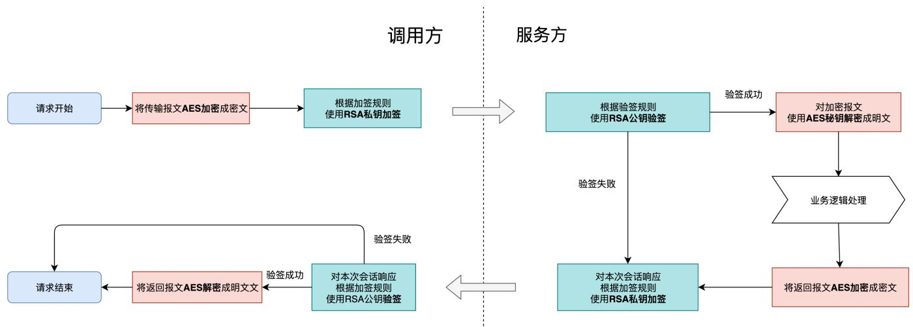

# 猫眼开放平台


版本记录


<table><tr><td>日期</td><td>版本</td><td>修订说明</td><td>内容</td></tr><tr><td>2024/8/26</td><td>1.0.0</td><td>初版修订</td><td></td></tr><tr><td>2025/10/20</td><td>1.0.0</td><td>增加套票支持</td><td>增加套票支持
2.3票档推送接口
新增字段：isSet、setDescription、baseOtSkuId、setNum
2.5创建订单接口
票节点增加字段：isPackage
详见接口字段说明</td></tr></table>

# 1.接⼝说明

# 1.1 概述

本⽂档详细说明了各⽅系统通过API接⼊⽅式与猫眼开放平台(以下简称MOP)对接的接⼝规范。

# 1.2接⼝回调域名

测试环境: https://myshow.test.maoyan.com

正式环境:请联系对接负责⼈进⾏获取。

# 1.3 接⼝权限获取

# 1.3.1 必要条件

<table><tr><td>AES秘钥</td><td>对业务报文加密解密</td></tr><tr><td>RSA钥匙对</td><td>用户接口加签验签</td></tr><tr><td>supplier供应商编码</td><td>供应商唯一凭证</td></tr></table>


注:测试环境和⽣产环境隔离, 必要条件两个环境不⼀样,都需要申请


# 1.3.2 获取⽅式

线下沟通

# 1.4 请求参数格式

# 1.4.1 header

<table><tr><td>supplier</td><td>String</td><td>供应商编码</td></tr><tr><td>timestamp</td><td>String</td><td>请求时间，精确到秒，格式化类型 &quot;yyyy-MM-dd HH:mm:ss&quot;</td></tr><tr><td>version</td><td>String</td><td>版本</td></tr><tr><td>sign</td><td>String</td><td>接口签名，签名生成规则如下所示</td></tr></table>

# 1.4.2 body

<table><tr><td>encryptData</td><td>String</td><td>业务密文,具体结构参考下面具体接口文档</td></tr></table>

⽰例:

```txt
Code block
1 {
2 "encryptData":"g9rSiAwzoz88L5CdaUmcri/uNMTWLho1ulhUyiwfBNy2Lo+hkKPC8XvjJFQKR/9t g0TDD38C7R6s0+tpgxzVUw=="
3 }
```

# 1.5响应结构格式

# 1.5.1 响应字段

<table><tr><td>code</td><td>String</td><td>响应码</td></tr><tr><td>timestamp</td><td>String</td><td>时间，精确到秒，格式化类型 &quot;yyyy-MM-dd HH:mm:ss&quot;</td></tr><tr><td>msg</td><td>String</td><td>接口响应提示信息</td></tr><tr><td>sign</td><td>String</td><td>响应签名</td></tr><tr><td>encryptData</td><td>String</td><td>业务信息密文 具体明文结构参考下列文档</td></tr></table>

⽰例:

通⽤相应

```txt
1 {
2 "code": 1000,
3 "timestamp": "2024-09-03 11:45:02",
4 "msg": "成功",
5 "sign": "PuHyfHlXc6RVVfJ3vch6MpFOF4RlxfwBGAHs0T0aN0M5ZDRVluQA0IAgUguQR65nOlttkZVKXIORvk W3MFdQGfmq3d5JmrVAS90xSnK3FLfiXX9JJyG2XFJyT7lvlqLrpwWI1NsiDR9yXrYsTNGIQdkSPCV9M VmXQmIl+o810LO=",
6 "encryptData": "g9rSiAwzoz88L5CdaUmcrsveiazar3icCx1/1MiJkNdbjQpFtMMQAELqs/Mm98C3g0TDD38C7R6s0+ tpgxzVUw=="
7 }
```

# 1.6安全性保证

# 1.6.1 安全性保证主要包括: 加签 $+$ 报⽂加密

# 1.6.1.1 具体分类

<table><tr><td>安全性规则</td><td>加密类型</td><td>加密算法</td><td>请求/响应</td><td>加签/加密规则(保证顺序)</td></tr><tr><td rowspan="2">验签</td><td rowspan="2">非对称加密</td><td rowspan="2">SHA256withRSA</td><td>Request</td><td>supplier + timestamp +version + URI用私钥加签</td></tr><tr><td>Response</td><td>code + timestamp 用私钥加签</td></tr><tr><td rowspan="2">报文加密</td><td rowspan="2">对称加密</td><td rowspan="2">AES/ECB/PKCS5Padding</td><td>Request</td><td>具体业务结构转JSON字符串用秘钥加密</td></tr><tr><td>Response</td><td>具体业务结构转JSON字符串用秘钥加密</td></tr></table>

# 1.6.1.2 流程




# 1.6.2 加签验签JAVA代码

```java
import org.apache.commons.codec.binary.Base64;

import java.nio.charset.StandardCharsets;
import java.security.KeyFactory;
import java.security.KeyPair;
import java.security.KeyPairGenerator;
import java.security.NoSuchAlgorithmException;
import java.security.PrivateKey;
import java.security.PublicKey;
import java.security.Signature;
import java.security.spec.PKCS8EncodedKeySpec;
import java.security.spec.X509EncodedKeySpec;

public class RSAUtils {
  public static final String SIGNATURE_ALGORITHM_SHA265 = "SHA256withRSA";
  public static final String RSA = "RSA";

  /**
   * 验签
   * SIGNATURE_ALGORITHM_SHA265
   *
   * @param srcData 原始字符串
   * @param publicKey    公钥
   * @return 是否验签通过
   */
  public static boolean verify(String srcData, String publicKey, String sign) throws Exception {
      KeyFactory keyFactory = KeyFactory.getInstance(RSA);
      byte[] keyBytes = Base64.decodeBase64(publicKey.getBytes());
      X509EncodedKeySpec keySpec = new X509EncodedKeySpec(keyBytes);
      PublicKey key = keyFactory.generatePublic(keySpec);
      Signature signature = Signature.getInstance(SIGNATURE_ALGORITHM_SHA265);
      signature.initVerify(key);
      signature.update(srcData.getBytes(StandardCharsets.UTF_8));
      return signature.verify(Base64.decodeBase64(sign.getBytes()));
  }

  /**
   * 加签
   * @param content 正文json 字符串
   * @param privateKey  私钥
   * @return 签名
   * @throws Exception
   */
  public static String sign(String content, String privateKey) throws Exception {
      byte[] keybyte = Base64.decodeBase64(privateKey);
      KeyFactory kf = KeyFactory.getInstance(RSA);
      PKCS8EncodedKeySpec keySpec = new PKCS8EncodedKeySpec(keybyte);
      PrivateKey privateKeyObject = kf.generatePrivate(keySpec);
      Signature signature = Signature.getInstance(SIGNATURE_ALGORITHM_SHA265);
      signature.initSign(privateKeyObject);
      signature.update(content.getBytes(StandardCharsets.UTF_8));
      String signBase64Str = Base64.encodeBase64String(signature.sign());
      return signBase64Str;
  }
```

# 1.6.3 加密解密JAVA代码

```java
import javax.crypto.Cipher;
import javax.crypto.KeyGenerator;
import javax.crypto.SecretKey;
import javax.crypto.spec.SecretKeySpec;
import java.util.Base64;
public class AESUtils {

  //加密算法
  private static final String ALGORITHM = "AES/ECB/PKCS5Padding";
  private static final String AES = "AES";

  /**
   * 加密
   *
   * @param data body JSONString 明文
   * @param key  秘钥
   * @return 密文
   * @throws Exception
   */
  public static String encrypt(String data, String key) throws Exception {
      SecretKeySpec secretKeySpec = new SecretKeySpec(key.getBytes(), AES);
      Cipher cipher = Cipher.getInstance(ALGORITHM);
      cipher.init(Cipher.ENCRYPT_MODE, secretKeySpec);
      byte[] encryptedBytes = cipher.doFinal(data.getBytes());
      return Base64.getEncoder().encodeToString(encryptedBytes);
  }

  /**
   * 解密
   *
   * @param encryptedData 密文
   * @param key           秘钥
   * @return body JSONString  明文
   * @throws Exception
   */
  public static String decrypt(String encryptedData, String key) throws Exception {
      SecretKeySpec secretKeySpec = new SecretKeySpec(key.getBytes(), AES);
      Cipher cipher = Cipher.getInstance(ALGORITHM);
      cipher.init(Cipher.DECRYPT_MODE, secretKeySpec);
      byte[] decryptedBytes = cipher.doFinal(Base64.getDecoder().decode(encryptedData));
      return new String(decryptedBytes);
  }
}
```

# 1.6.4 案例以及加密前后密⽂明⽂对⽐

# 1.6.4.1 案例

**RSA: publicKey** = "MIGfMA0GCSqGSIb3DQEBAQUAA4GNADCBiQKBgQC4/ZNBaKROMDQ7A9BiXiRwBvVa qMYywdM7FNo0nYELE3pMsdSgR0ZfENaX3wcIcuUCxkDPstpFMtU2fiBf7HIELLS9 8qwy+Ak1OyRoQfu6sPiSd6Krz34e0H9m0GvqkcEMp3XUcedjCnVFK8ACLhOKTwG5 00G5ioOzumJ/RHhxQwIDAQAB";

**RSA: privateKey** = "MIICdwIBADANBgkqhkiG9w0BAQEFAASCAmEwggJdAgEAAoGBALj9k0FopE4wNDsD 0GJeJHAG9VqoxjLB0zsU2jSdgQsTekyx1KBHRl8Q1pffBwhy5QLGQM+y2kUy1TZ+ IF/scgQstL3yrDL4CTU7JGhB+7qw+JJ3oqvPfh7Qf2bQa+qRwQynddRx52MKdUUr wAIuE4pPAbnTQbmKg7O6Yn9EeHFDAgMBAAECgYAIrgUxxXooHQTmW/h0FRy6kOkE NvUNvqBtnj3ayCUc4u4TGSjz2ERKA50+BP3sfI+YQLsbw7WQF6F/bA2S0qJK0TTH kwap4OeWA1fUhlB+9KkjMji7JY7YWZegBs3ecsULm6sMYnN6BbyEjki8TCrdHgul J09TR5E0TiG+B7Pk2QJBAPxdmNm7JrKUvYxgdqutLUO60xozZptRHhK/1JpxdRvC a33VHy1ZIDWLBebajOgEvFY/LoJhTqntmvVedseuMt8CQQC7p5WrnKNo4bN2qqVm RMoauw3CLPiWf0N5EUXqj4rNs4E3udiGa2wbYnBSMUCVTOMKwxxC7wVRmi/Na5XP 9xIdAkEAiZ0cUXZtZqoXJmofrAP2D93baYkn5X/5Ty4N594Ahw+gf/BsXNUh7DCQ Gk+I0KhsbvdrDCu1spHfkvdc/AvwrwJAESj1BdlwFAI3sA1QzLZTqPgb/PqxzMlc eTC8LQPtVHwqv9bN1xTxsNtinBGG72A1juFirzg+S0UHRAinjXnxfQJBAMqkjgWg iisGqJBa4FJKaCiQcd6mkwcEcsnHyZQwwThDnKO7B1bidrR/vTNbXtOqaIp8xSD1 +Lr8g7aemcG2Mzw=";

**AES: key** = "PCOnnpSKl3op+ROVAltmwHuyYBcQEhy0";


```bash
# 请求:
curl --location 'localhost:8080/mop/test/project' \
--header 'supplier: S_001' \
--header 'timestamp: 2024-09-03 11:45:01' \
--header 'version: 1.0.1' \
--header 'sign: NEbQhpw2D0z3KLrw7pbrbDiF+Mm8OqjCFpkeqxOW+3TpBPxYJ18intY6rpoSG6ALYMkPFmYn9IwG6tDlfm1LJk3JJQK3e8kSNTmY5TndP6cIO/nb7jdhXDkSy1s5/8PCh5YNa4h281rZGyQttundWgJU/Wpnn75aX/5y64T1NQA=' \
--header 'Content-Type: application/json' \
--data '{
"encryptData":"g9rSiAwzoz88L5CdaUmcri/uNMTWLho1ulhUyiwfBNy2Lo+hkKPC8XvjJFQKR/9tg0TDD38C7R6s0+tpgxzVUw=="
}'

# 响应:
{
    "code": 1000,
    "timestamp": "2024-09-03 11:45:02",
    "msg": "成功",
    "sign": "PuHyfHlXc6RVVfJ3vch6MpFOF4RlxfwBGAHs0TOaNoM5ZDRVluQA0IAgUguQR65nOlttkZVKXIORvkW3MFdQGfmq3d5JmrVAs9OxSnK3FLfiXX9JJyG2XFJyT7lvlqLrpwWI1NsiDR9yXrYsTNGIQdkSPCV9MVmXQmIl+o81OL0=",
    "encryptData": "g9rSiAwzoz88L5CdaUmcrsveiazar3icCx1/1MiJkNdbjQpFtMMQAELqs/Mm98C3g0TDD38C7R6s0+tpgxzVUw=="
}
```

# 1.6.4.2 具体加密分析

# 1.6.4.2.1 请求

| - | - |
| - | - |
| sign | "S_001" + "2024-09-03 11:45:01" + "1.0.1" + "/supply/open/mop/test/project"  AND RSA私钥 |
| encryptData | {"projectName":"笑傲江湖","cityName":"上海"} AND AES秘钥 |


# 1.6.4.2.2 响应

| - | - |
| - | - |
| sign | "1000" + "2024-09-03 11:45:02" AND RSA私钥 |
| encryptData | {"projectName":"天龙八部","cityName":"北京"} AND AES秘钥 |

# 1.7 其他说明

# 1.7.1 城市编码

统⼀采⽤2023年中华⼈⺠共和国县以上⾏政区划代码。⽬前仅⽀持⾄市级代码，针对下⼀级区划代码暂不⽀持。

参考链接 https://www.mca.gov.cn/mzsj/xzqh/2023/202301xzqh.html

# 1.7.2库存托管模式

区别于常规的下单模式，⽤⼾下单后猫眼会同步向渠道下单外，MOP可另外⽀持库存托管模式。

库存托管模式，需要⽤⼾在同步票档信息时设置库存类型为独⽴库存并设置托管库存数量，渠道⽅需确保这部分库存属于猫眼独享并⼀定能够下单成功。

# 2.接⼝明细

下⽰接⼝主要分为接⼊⽅调⽤猫眼接⼝(A类接⼝)以及猫眼调⽤接⼊⽅接⼝(B类接⼝)。

# 2.1项⽬推送接⼝

# 2.1.1 基础信息

<table><tr><td>接口类型</td><td>A</td></tr><tr><td>调用方法</td><td>POST</td></tr><tr><td>URL</td><td>/supply/open/mop/project/push</td></tr><tr><td>Content-Type</td><td>application/json</td></tr></table>

# 2.1.2请求参数列表

<table><tr><td>父元素名称</td><td>类型</td><td>是否必传</td><td>描述</td></tr><tr><td>cityId</td><td>String</td><td>是</td><td>城市ID</td></tr><tr><td>cityName</td><td>String</td><td>是</td><td>城市名称//猫眼当前只支持市,不支持区,(国标)</td></tr><tr><td>otProjectId</td><td>String</td><td>是</td><td>演出ID 增删改key</td></tr><tr><td>category</td><td>Integer</td><td>是</td><td>类目//见枚举→项目类目</td></tr><tr><td>otVenueId</td><td>String</td><td>是</td><td>场馆ID //景点景区</td></tr><tr><td>otVenueName</td><td>String</td><td>是</td><td>场馆name //景点景区</td></tr><tr><td>projectStatus</td><td>Integer</td><td>是</td><td>项目状态//0:无效,1:有效;项目下架或者删除也需要同步</td></tr><tr><td>name</td><td>String</td><td>是</td><td>演出名称(limit length:50)</td></tr><tr><td>shortName</td><td>String</td><td></td><td>演出简称(limit length:20)</td></tr><tr><td>startTime</td><td>String</td><td></td><td>首场开售时间yyyy-MM-dd HH:mm:ss</td></tr><tr><td>endTime</td><td>String</td><td></td><td>末场开售时间yyyy-MM-dd HH:mm:ss</td></tr><tr><td>maxBuyLimitPerId</td><td>Integer</td><td></td><td>项目维度每个有效证件最大购买份数</td></tr><tr><td>maxBuyLimitPerOrder</td><td>Integer</td><td></td><td>项目维度每笔订单最大购买份数</td></tr><tr><td>maxBuyLimitPerUser</td><td>Integer</td><td></td><td>项目维度每个用户最大购买份数</td></tr><tr><td>maxOrderLimitPerUser</td><td>Integer</td><td></td><td>项目维度每个用户最大购买订单数 (MAX阈值)</td></tr><tr><td>seatType</td><td>Integer</td><td>是</td><td>座位类型//1-无座/非选座,2-有座/选座</td></tr><tr><td>needRealName</td><td>Integer</td><td>是</td><td>是否实名制购票//0:N;1:Y</td></tr><tr><td>attributes</td><td>List&lt;String&gt;</td><td></td><td>目前放置certificates,证件类型[&quot;1&quot;,&quot;2&quot;,&quot;3&quot;,&quot;4&quot;] (needRealName==1时必输) 见枚举</td></tr><tr><td>posterUrl</td><td>String</td><td>是</td><td>海报图(limit length:200)</td></tr><tr><td>pseatTicketUrl</td><td>String</td><td></td><td>票区图(选座)(limit length:200)</td></tr><tr><td>ticketPurchaseNotice</td><td>String</td><td></td><td>购票须知(HTML\文本)(暂无长度限制)</td></tr><tr><td>projectDesc</td><td>String</td><td></td><td>项目详情(HTML\文本)(暂无长度限制)</td></tr></table>

⽰例:


Code block


```json
1 {
    "cityId": "310000",
    "cityName": "上海市",
    "otProjectId": "184674438436570001",
    "category": 1,
    "otVenueId": "18467342033470003",
    "otVenueName": "上海体育场",
    "projectStatus": 1,
    "name": "项目名称",
    "shortName": "项目简称",
    "startTime": null,
    "endTime": null,
    "maxBuyLimitPerId": 0,
    "maxBuyLimitPerOrder": 0,
    "maxBuyLimitPerUser": 0,
    "maxOrderLimitPerUser": 0,
    "seatType": 1,
    "needRealName": 1,
    "attributes": ["1","2","3","4"],
    "posterUrl": "https://test-file.show.xiaoxiatech.com/showcloud/e5a4c6a2-274d-4ce6-bf67-a5ef044142ab.png",
    "ticketPurchaseNotice": "购票须知",
    "projectDesc": "项目详情"
}
```

# 2.1.3响应参数列表

通⽤响应即可

# 2.2场次推送接⼝

# 2.2.1 基础信息

<table><tr><td>接口类型</td><td>A</td></tr><tr><td>调用方法</td><td>POST</td></tr><tr><td>URL</td><td>/supply/open/mop/show/push</td></tr><tr><td>Content-Type</td><td>application/json</td></tr></table>

# 2.2.2请求参数列表

<table><tr><td>父元素名称</td><td>元素名称</td><td>类型</td><td>是否必传</td><td>描述</td></tr><tr><td rowspan="2"></td><td>otProjectId</td><td>String</td><td>是</td><td>项目ID</td></tr><tr><td>shows</td><td>List&lt;MopShowDTO&gt;</td><td>是</td><td>场次</td></tr><tr><td rowspan="16">shows</td><td>otShowId</td><td>String</td><td>是</td><td>场次ID，需要保证全局唯一，不同项目</td></tr><tr><td>otShowStatus</td><td>Integer</td><td>是</td><td>场次状态//0:无效;1:有效，场次下架或同步</td></tr><tr><td>name</td><td>String</td><td></td><td>场次name (limit length: 80) (不传默认</td></tr><tr><td>startTime</td><td>String</td><td>是</td><td>场次开始时间 yyyy-MM-dd HH:mm:ss 始时间相同的场次)</td></tr><tr><td>endTime</td><td>String</td><td>是</td><td>场次结束时间 yyyy-MM-dd HH:mm:ss 1时, 结束时间必须和开始时间同一天)</td></tr><tr><td>onSaleTime</td><td>String</td><td></td><td>场次开售时间 yyyy-MM-dd HH:mm:ss 即开售)</td></tr><tr><td>offSaleTime</td><td>String</td><td></td><td>场次停售时间 yyyy-MM-dd HH:mm:ss 次开始时间即为停售时间)</td></tr><tr><td>onSaleType</td><td>Integer</td><td></td><td>开售时间类型，1：审核后立即开售，2 时间(默认为1, offSaleTime有值, 即为:</td></tr><tr><td>showType</td><td>Integer</td><td>是</td><td>场次类型 // 1为单场票(演出时间不能跨 票;</td></tr><tr><td>showNode</td><td>String</td><td></td><td>场次备注 (暂无长度限制)</td></tr><tr><td>areaUrl</td><td>String</td><td>是</td><td>区域图URL(选座必传)(limit length: 20</td></tr><tr><td>maxBuyLimitPerId</td><td>Integer</td><td></td><td>场次维度每个有效证件最大购买份数</td></tr><tr><td>maxBuyLimitPerOrder</td><td>Integer</td><td></td><td>场次维度每笔订单最大购买份数</td></tr><tr><td>maxBuyLimitPerUser</td><td>Integer</td><td></td><td>场次维度每个用户最大购买量</td></tr><tr><td>showLimit</td><td>Integer</td><td></td><td>限购0:关闭1:打开(默认开)</td></tr><tr><td>fetchTicketWay</td><td>ListQE</td><td>是</td><td>取票方式//见枚举→取票方式(注意: 凭证件入场&quot;时必须是实名制项目才可用 过滤)</td></tr></table>

⽰例:

```json
1 {
    "otProjectId": "184674438436570001",
    "shows": [
        {
            "otShowId": "1342342342342001",
            "otShowStatus": 1,
            "name": "2024-11-03 16:00:00",
            "startTime": "2024-11-03 16:00:00",
            "endTime": "2024-11-03 23:00:00",
            "onSaleTime": "2024-10-13 00:00:00",
            "offSaleTime": "2024-10-31 00:00:00",
            "onSaleType": 2,
            "showType": 1,
            "showNote": null,
            "areaUrl": null,
            "maxBuyLimitPerId": 10,
            "maxBuyLimitPerOrder": 1,
            "maxBuyLimitPerUser": 1,
            "showLimit": 1,
            "fetchTicketWay": [
                2
            ]
        }
    ]
}
```

# 2.2.3响应参数列表

通⽤响应即可

# 2.3 票档推送接⼝

# 2.3.1 基础信息

<table><tr><td>接口类型</td><td>A</td></tr><tr><td>调用方法</td><td>POST</td></tr><tr><td>URL</td><td>/supply/open/mop/sku/push</td></tr><tr><td>Content-Type</td><td>application/json</td></tr></table>

# 2.3.2请求参数列表

<table><tr><td>父元素名称</td><td>元素名称</td><td>类型</td><td>是否必传</td><td>描述</td></tr><tr><td rowspan="2"></td><td>otProjectId</td><td>String</td><td>是</td><td>项目ID</td></tr><tr><td>skus</td><td>List&lt;MopSkuDTO&gt;</td><td>是</td><td>SKU</td></tr><tr><td rowspan="16">skus</td><td>otShowId</td><td>String</td><td>是</td><td>场次ID //当isOta==0;该字段必须有值,保证全局唯一,不同场次间不可复用票档</td></tr><tr><td>otSkuId</td><td>String</td><td>是</td><td>票档ID(场次内独享,全局唯一)</td></tr><tr><td>otSkuStatus</td><td>Integer</td><td>是</td><td>票档状态//0:无效,1:有效;票档删除或者下架也需要同步</td></tr><tr><td>name</td><td>String</td><td></td><td>票档名称(limit length:80)</td></tr><tr><td>ticketDesc</td><td>String</td><td></td><td>票档描述(暂无长度限制)</td></tr><tr><td>maxBuyLimit</td><td>Integer</td><td></td><td>每个订单最大购买数量</td></tr><tr><td>skuPrice</td><td>String</td><td>是</td><td>票面价(单位元)</td></tr><tr><td>sellPrice</td><td>String</td><td>是</td><td>售卖价格(单位元)</td></tr><tr><td>isLimit</td><td>Integer</td><td></td><td>是否票档限购(默认1)</td></tr><tr><td>onSaleTime</td><td>String</td><td>是</td><td>票档开售时间yyyy-MM-dd HH:mm:ss</td></tr><tr><td>offSaleTime</td><td>String</td><td>是</td><td>票档停售时间yyyy-MM-dd HH:mm:ss</td></tr><tr><td>inventoryType</td><td>String</td><td>是</td><td>库存类型0:未设置1:共享库存2:独立库存(推荐使用共享库存,独立库存只在第一次推送生效,后续的库存变动更新需要通知运营在我们平台手动更新)</td></tr><tr><td>isSet</td><td>Integer</td><td></td><td>是否是套票票档,0:否1:是,不传默认为否</td></tr><tr><td>setDescription</td><td>String</td><td></td><td>套票描述</td></tr><tr><td>baseOtSkuId</td><td>String</td><td>如果是套票必传</td><td>基础票档id,套票不可跨票档,</td></tr><tr><td>setNum</td><td>Integer</td><td>如果是套票必传</td><td>每份包含张数</td></tr></table>

⽰例:

```json
{
    "otProjectId": "184674438436570001",
    "isOta": 0,
    "skus": [
        {
            "otShowId": "1342342342342001",
            "otSkuId": "1001",
            "otSkuStatus": 1,
            "name": "VVVIP",
            "ticketDesc": "VVVIP",
            "maxBuyLimit": 10,
            "skuPrice": "199",
            "sellPrice": "199",
            "isLimit": 1,
            "onSaleTime": "2024-11-31 08:00:00",
            "offSaleTime": "2024-12-31 20:00:00",
            "inventoryType": 1
        },
         {
            "otShowId": "1342342342342001",
            "otSkuId": "1002",
            "otSkuStatus": 1,
            "name": "VIP",
            "ticketDesc": "VIP",
            "maxBuyLimit": 10,
            "skuPrice": "299",
            "sellPrice": "299",
            "isLimit": 1,
            "onSaleTime": "2024-11-31 08:00:00",
            "offSaleTime": "2024-12-31 20:00:00",
            "inventoryType": 1
        },
         {
            "otShowId": "1342342342342001",
            "otSkuId": "1003",
            "otSkuStatus": 1,
            "name": "VIP",
            "ticketDesc": "VIP",
            "maxBuyLimit": 10,
            "skuPrice": "399",
            "sellPrice": "399",
            "isLimit": 1,
            "onSaleTime": "2024-11-31 08:00:00",
            "offSaleTime": "2024-12-31 20:00:00",
            "inventoryType": 1,
            "isSet":1,
            "setDescription":"这是一个套票",
            "baseOtSkuId":"1002",
            "setNum":2
        }
    ]
}
```

# 2.3.3响应参数列表

# 2.4 库存推送接⼝

# 2.4.1 基础信息

<table><tr><td>接口类型</td><td>A</td></tr><tr><td>调用方法</td><td>POST</td></tr><tr><td>URL</td><td>/supply/open/mop/stock/push</td></tr><tr><td>Content-Type</td><td>application/json</td></tr></table>

# 2.4.2请求参数列表

<table><tr><td>父元素名称</td><td>元素名称</td><td>类型</td><td>是否必传</td><td>描述</td></tr><tr><td rowspan="2"></td><td>otProjectId</td><td>String</td><td>是</td><td>项目ID</td></tr><tr><td>stocks</td><td>List&lt;MopStockDTO&gt;</td><td>是</td><td>库存</td></tr><tr><td rowspan="4">stocks</td><td>otShowId</td><td>String</td><td>是</td><td>场次ID</td></tr><tr><td>otSkuId</td><td>String</td><td>是</td><td>商品ID，套票票档无需推送库存，系统自动由基础票档库存计算</td></tr><tr><td>inventoryType</td><td>Integer</td><td>是</td><td>库存类型0:未设置1:共享库存2:独立库存(独立库存不支持库存修改)</td></tr><tr><td>stock</td><td>Integer</td><td>是</td><td>库存数</td></tr></table>

# ⽰例:

Code block

```txt
1 {
2 "otProjectId": "184674438436570001",
3 "stocks": [
4 {
5 "otShowId": "1342342342342001",
6 "otSkuId": "1001",
7 "inventoryType": 1,
8 "stock": 1000
9 },
10 {
11 "otShowId": "1342342342342001",
12 "otSkuId": "1002",
13 "inventoryType": 1,
14 "stock": 1000
15 },
```

```txt
16 {
17 "otShowId": "1342342342342001",
18 "otSkuId": "1003",
19 "inventoryType": 1,
20 "stock": 1000
21 }
22 ]
23 }
```

# 2.4.3响应参数列表

通⽤响应即可

# 2.5创建订单接⼝

# 2.5.1 基础信息

<table><tr><td>接口类型</td><td>B</td></tr><tr><td>调用方法</td><td>POST</td></tr><tr><td>URL</td><td>/mop/order</td></tr><tr><td>Content-Type</td><td>application/json</td></tr></table>

# 2.5.2请求参数列表

<table><tr><td>父元素名称</td><td>元素名称</td><td>类型</td><td>是否必传</td><td>描述</td></tr><tr><td rowspan="10"></td><td>myOrderId</td><td>String</td><td>是</td><td>猫眼订单ID</td></tr><tr><td>projectCode</td><td>String</td><td>是</td><td>项目编码</td></tr><tr><td>projectShowCode</td><td>String</td><td>是</td><td>场次编码</td></tr><tr><td>buyerName</td><td>String</td><td>是</td><td>购票人姓名</td></tr><tr><td>buyerPhone</td><td>String</td><td>是</td><td>购票人手机号</td></tr><tr><td>totalPrice</td><td>String</td><td>是</td><td>去除优惠金额后的订单总价，保留两位小数（单位元）</td></tr><tr><td>needSeat</td><td>Boolean</td><td>是</td><td>是否是选座订单</td></tr><tr><td>needRealName</td><td>Boolean</td><td>是</td><td>是否是实名制订单</td></tr><tr><td>ticketInfo</td><td>List&lt;Ticket&gt;</td><td>是</td><td>订单票信息列表</td></tr><tr><td>deliveryInfo</td><td>Delivery</td><td>是</td><td>订单取票信息</td></tr><tr><td rowspan="14">ticketInfo</td><td>myTicketId</td><td>String</td><td>是</td><td>猫眼票ID</td></tr><tr><td>seatId</td><td>String</td><td></td><td>座位ID(选座订单必传)</td></tr><tr><td>seatName</td><td>String</td><td></td><td>座位名称(选座订单必传)</td></tr><tr><td>row</td><td>String</td><td></td><td>行号(选座订单必传)</td></tr><tr><td>col</td><td>String</td><td></td><td>列号(选座订单必传)</td></tr><tr><td>areaId</td><td>String</td><td></td><td>分区ID(选座订单必传)</td></tr><tr><td>areaName</td><td>String</td><td></td><td>分区名称(选座订单必传)</td></tr><tr><td>skuId</td><td>String</td><td>是</td><td>所属票档ID(如果选择的是套票时传套票的票档id)</td></tr><tr><td>ticketPrice</td><td>String</td><td>是</td><td>票面价格，保留两位小数（单位元）</td></tr><tr><td>userName</td><td>String</td><td></td><td>实名制观演人姓名(实名制订单必传)</td></tr><tr><td>idType</td><td>Integer</td><td></td><td>实名制观演人证件类型(实名制订单必传)</td></tr><tr><td>idNumber</td><td>String</td><td></td><td>实名制观演人证件号(实名制订单必传)</td></tr><tr><td>discounts</td><td>Discount</td><td></td><td>优惠信息</td></tr><tr><td>isPackage</td><td>Integer</td><td></td><td>是否套票：0否，1是</td></tr><tr><td rowspan="3">deliveryInfo</td><td>fetchType</td><td>Integer</td><td>是</td><td>取票方式//见枚举</td></tr><tr><td>recipientName</td><td>String</td><td>是</td><td>收货人姓名</td></tr><tr><td>recipientMobile</td><td>String</td><td>是</td><td>收货人手机号</td></tr><tr><td rowspan="5">discounts</td><td>skuId</td><td>String</td><td></td><td>所属票档ID</td></tr><tr><td>otActivityId</td><td>String</td><td></td><td>活动ID</td></tr><tr><td>conditionValue</td><td>String</td><td></td><td>命中规则</td></tr><tr><td>promoValue</td><td>String</td><td></td><td>*折/减*元</td></tr><tr><td>hitCounts</td><td>String</td><td></td><td>命中次数</td></tr></table>

# 2.5.3响应参数列表

<table><tr><td>父元素名称</td><td>元素名称</td><td>类型</td><td>是否必传</td><td>描述</td></tr><tr><td rowspan="3"></td><td>myOrderId</td><td>String</td><td>是</td><td>猫眼订单ID</td></tr><tr><td>channelOrderId</td><td>String</td><td>是</td><td>渠道订单ID</td></tr><tr><td>payExpiredTime</td><td>String</td><td></td><td>支付过期时间(未来某个时间点的毫秒级时间戳)若不返回则默认按照订单创建后15分钟设置，独立库存默认5分钟</td></tr></table>

# 注：下单响应code码请严格参照⽂末错误码明细回传

# 2.5.4接⼝请求/响应⽰例

```json
Request
{
    "myOrderId": "20001595062",
    "projectCode": "80033343",
    "projectShowCode": "200051948",
    "buyerName": "张三",
    "buyerMobile": "18342568395",
    "totalPrice": "80.00",
    "needSeat": true,
    "needRealName": true,
    "ticketInfo": [
        {
            "myTicketId": "6141177",
            "seatId": "302290394",
            "seatName": "1排25座",
            "row": "1",
            "col": "25",
            "areaId": "72866",
            "areaName": "乐池",
            "skuId": "85383",
            "ticketPrice": "80.00",
            "userName": "张三",
            "idType": 1,
            "idNumber": "131636191904260820"
        }
    ],
    "deliveryInfo": [
        {
            "deliveryType": 1,
            "recipientName": "张三",
            "recipientMobile": "18342568395"
        }
    ]
}

==========================
Response
{
    "myOrderId": "20001595062",
    "channelOrderId": "2024040217233400012704",
    "payExpiredTime": "1729500276515"
}
```

# 2.6 ⽀付确认接⼝

# 2.6.1 基础信息

<table><tr><td>接口类型</td><td>B</td></tr><tr><td>调用方法</td><td>POST</td></tr><tr><td>URL</td><td>/mop/ticket</td></tr><tr><td>Content-Type</td><td>application/json</td></tr></table>

# 2.6.2请求参数列表

<table><tr><td>父元素名称</td><td>元素名称</td><td>类型</td><td>是否必传</td><td>描述</td></tr><tr><td></td><td>myOrderId</td><td>String</td><td>是</td><td>猫眼订单ID</td></tr></table>

# 2.6.3响应参数列表

<table><tr><td>父元素名称</td><td>元素名称</td><td>类型</td><td>是否必传</td><td>描述</td></tr><tr><td rowspan="5"></td><td>myOrderId</td><td>String</td><td>是</td><td>猫眼订单ID</td></tr><tr><td>fetchCode</td><td>String</td><td></td><td>取票码</td></tr><tr><td>fetchQrCode</td><td>String</td><td></td><td>取票二维码</td></tr><tr><td>orderStatus</td><td>Integer</td><td>是</td><td>订单状态</td></tr><tr><td>ticketInfo</td><td>List&lt;Ticket&gt;</td><td>是</td><td>票信息</td></tr><tr><td rowspan="4">ticketInfo</td><td>myTicketId</td><td>String</td><td>是</td><td>猫眼票ID</td></tr><tr><td>channelTicketId</td><td>String</td><td>是</td><td>渠道票ID</td></tr><tr><td>checkCode</td><td>String</td><td></td><td>检票码</td></tr><tr><td>checkQrCode</td><td>String</td><td></td><td>检票二维码</td></tr></table>

# 2.6.4接⼝请求/响应⽰例

```json
Request
{
    "myOrderId": "20001595062"
}

==========================
Response
{
    "myOrderId": "20001595062",
    "orderStatus": 4,
    "ticketInfo": [
        {
            "myTicketId": "6141177",
            "channelTicketId": "585672460389097544"
        }
    ]
}
```

# 2.7订单查询接⼝

# 2.7.1 基础信息

<table><tr><td>接口类型</td><td>B</td></tr><tr><td>调用方法</td><td>POST</td></tr><tr><td>URL</td><td>/mop/orderQuery</td></tr><tr><td>Content-Type</td><td>application/json</td></tr></table>

# 2.7.2请求参数列表

<table><tr><td>父元素名称</td><td>元素名称</td><td>类型</td><td>是否必传</td><td>描述</td></tr><tr><td></td><td>myOrderId</td><td>String</td><td>是</td><td>猫眼订单ID</td></tr></table>

# 2.7.3响应参数列表

<table><tr><td>父元素名称</td><td>元素名称</td><td>类型</td><td>是否必传</td><td>描述</td></tr><tr><td rowspan="7"></td><td>myOrderId</td><td>String</td><td>是</td><td>猫眼订单ID</td></tr><tr><td>fetchCode</td><td>String</td><td></td><td>取票码</td></tr><tr><td>fetchQrCode</td><td>String</td><td></td><td>取票二维码</td></tr><tr><td>orderStatus</td><td>Integer</td><td>是</td><td>订单主状态</td></tr><tr><td>orderRefundStatus</td><td>Integer</td><td>是</td><td>订单退款状态</td></tr><tr><td>orderConsumeStatus</td><td>Integer</td><td>是</td><td>订单核销状态</td></tr><tr><td>ticketInfo</td><td>List&lt;Ticket&gt;</td><td>是</td><td>票信息</td></tr><tr><td rowspan="5">ticketInfo</td><td>myTicketId</td><td>String</td><td>是</td><td>猫眼票ID</td></tr><tr><td>channelTicketId</td><td>String</td><td>是</td><td>渠道票ID</td></tr><tr><td>ticketConsumeStatus</td><td>Integer</td><td>是</td><td>票核销状态</td></tr><tr><td>checkCode</td><td>String</td><td></td><td>检票码</td></tr><tr><td>checkQrCode</td><td>String</td><td></td><td>检票二维码</td></tr></table>

# 2.7.4接⼝请求/响应⽰例

```json
Request
{
    "myOrderId": "20001595062"
}

==========================
Response
{
    "myOrderId": "20001595062",
    "fetchCode": null,
    "fetchQrCode": null,
    "orderStatus": 7,
    "orderRefundStatus": 0,
    "orderConsumeStatus": 0,
    "ticketInfo": [
        {
            "myTicketId": "6141177",
            "channelTicketId": "585672460389097544",
            "ticketConsumeStatus": 0,
            "checkCode": "6649862059761665",
            "checkQrCode": "6649862059761665"
        }
    ]
}
```

# 2.8订单关键状态变更通知

# 2.8.1 基础信息

<table><tr><td>接口类型</td><td>B</td></tr><tr><td>调用方法</td><td>POST</td></tr><tr><td>URL</td><td>/mop/orderStatusChange</td></tr><tr><td>Content-Type</td><td>application/json</td></tr></table>

# 2.8.2请求参数列表

<table><tr><td>父元素名称</td><td>元素名称</td><td>类型</td><td>是否必传</td><td>描述</td></tr><tr><td rowspan="2"></td><td>myOrderId</td><td>String</td><td>是</td><td>猫眼订单ID</td></tr><tr><td>bizType</td><td>Integer</td><td>是</td><td>业务类型，0：订单取消，1：订单退款</td></tr></table>

# 2.8.3响应参数列表

通⽤响应即可

# 2.8.4接⼝请求/响应⽰例

```txt
Code block
1 Request
2 {
3 "myOrderId": "20001595062",
4 "bizType": 1
5 }
```

# 2.9订单核销通知

# 2.9.1 基础信息

<table><tr><td>接口类型</td><td>A</td></tr><tr><td>调用方法</td><td>POST</td></tr><tr><td>URL</td><td>/supply/open/mop/consume</td></tr><tr><td>Content-Type</td><td>application/json</td></tr></table>

# 2.9.2请求参数列表

<table><tr><td>父元素名称</td><td>元素名称</td><td>类型</td><td>是否必传</td><td>描述</td></tr><tr><td rowspan="3"></td><td>myOrderId</td><td>String</td><td>是</td><td>猫眼订单ID</td></tr><tr><td>ticketInfo</td><td>List&lt;String&gt;</td><td></td><td>所需核销猫眼票ID，若不传入票ID则表明整单核销</td></tr><tr><td>ticketCheckList</td><td>List&lt;TicketCheckLimitDTO&gt;</td><td></td><td>多次核销票时,必传;如通票核销时;可以多次核销</td></tr><tr><td rowspan="3">ticketCheckList</td><td>myTicketId</td><td>String</td><td></td><td>猫眼票ID</td></tr><tr><td>checkNum</td><td>Integer</td><td></td><td>第几次检票</td></tr><tr><td>checkLimit</td><td>Integer</td><td></td><td>最大检票次数</td></tr></table>

注释:

(1) 当myOrderId有值; ticketInfo 和 ticketCheckList 没有值时; 按整单核销;

(2) 当myOrderId 和 ticketCheckList 有值时; 按票次数判断进⾏核销; 常⻅与套票; 猫眼侧只会在checkNum $= =$ checkLimit 对票进⾏核销

# 2.9.3响应参数列表

通⽤响应即可

# 2.9.4接⼝请求/响应⽰例

```txt
Code block
1 Request
2 {
3 "myOrderId": "20001595062"
4 "ticketInfo": ["6141177"]
5 }
```

# 2.10订单出票通知

# 2.10.1 基础信息

<table><tr><td>接口类型</td><td>A</td></tr><tr><td>调用方法</td><td>POST</td></tr><tr><td>URL</td><td>/supply/open/mop/ticketNotify</td></tr><tr><td>Content-Type</td><td>application/json</td></tr></table>

# 2.10.2 请求参数列表

<table><tr><td>父元素名称</td><td>元素名称</td><td>类型</td><td>是否必传</td><td>描述</td></tr><tr><td rowspan="5"></td><td>myOrderId</td><td>String</td><td>是</td><td>猫眼订单ID</td></tr><tr><td>fetchCode</td><td>String</td><td></td><td>取票码</td></tr><tr><td>fetchQrCode</td><td>String</td><td></td><td>取票二维码</td></tr><tr><td>ticketInfo</td><td>List&lt;Ticket&gt;</td><td>是</td><td>票信息</td></tr><tr><td>performResult</td><td>Integer</td><td>是</td><td>出票失败0出票成功1</td></tr><tr><td rowspan="7">ticketInfo</td><td>myTicketId</td><td>String</td><td>是</td><td>猫眼票ID</td></tr><tr><td>checkCode</td><td>String</td><td></td><td>检票码</td></tr><tr><td>checkQrCode</td><td>String</td><td></td><td>检票二维码</td></tr><tr><td>floor</td><td>String</td><td></td><td>楼层名称</td></tr><tr><td>seatName</td><td>String</td><td></td><td>座位名称</td></tr><tr><td>areaName</td><td>String</td><td></td><td>区域名称</td></tr><tr><td>seatId</td><td>String</td><td></td><td>渠道座位ID</td></tr></table>

# 2.10.3 响应参数列表

通⽤响应即可

# 2.10.4接⼝请求/响应⽰例

```txt
Code block
1 Request
2 {
3 "myOrderId": "20001595062",
4 "fetchCode": null,
5 "fetchQrCode": null,
6 "ticketInfo": [
7 {
8 "myTicketId": "6141177",
9 "checkCode": "6649862059761665",
10 "checkQrCode": "6649862059761665"
11 }
12 ]
13 }
```

# 2.11动态码查询接⼝

# 2.11.1 基础信息

<table><tr><td>接口类型</td><td>B</td></tr><tr><td>调用方法</td><td>POST</td></tr><tr><td>URL</td><td>/mop/queryDynamicCode</td></tr><tr><td>Content-Type</td><td>application/json</td></tr></table>

# 2.11.2 请求参数列表

<table><tr><td>父元素名称</td><td>元素名称</td><td>类型</td><td>是否必传</td><td>描述</td></tr><tr><td rowspan="2"></td><td>myOrderId</td><td>String</td><td>是</td><td>猫眼订单ID</td></tr><tr><td>myTicketId</td><td>String</td><td>是</td><td>猫眼票ID</td></tr></table>

# 2.11.3 响应参数列表

<table><tr><td>父元素名称</td><td>元素名称</td><td>类型</td><td>是否必传</td><td>描述</td></tr><tr><td rowspan="5"></td><td>myOrderId</td><td>String</td><td>是</td><td>猫眼订单ID</td></tr><tr><td>myTicketId</td><td>String</td><td>是</td><td>猫眼票ID</td></tr><tr><td>code</td><td>String</td><td></td><td>动态码</td></tr><tr><td>qrCode</td><td>String</td><td></td><td>动态二维码</td></tr><tr><td>codingType</td><td>Integer</td><td></td><td>码类型 冗余字 段</td></tr></table>

# 2.11.4接⼝请求/响应⽰例

Code block
1 Request
2 {
3 "myOrderId": "20001595062",
4 "myTicketId": "6141177"
5 }
6
7 \(= = = = = = = = = = = = = = = = = = = = = = = = = = = = = = = = = = = = = = = = = = = = = = = = = = = = = = = = = = = = = = =
8\) Response
9 {
10 "myOrderId": "20001595062",
11 "myTicketId": "6141177"
12 "code": "6649862059761665",
13 "qrCode": "6649862059761665"
14 }

# 2.12座位同步接⼝

# 2.12.1 基础信息

<table><tr><td>接口类型</td><td>A</td></tr><tr><td>调用方法</td><td>POST</td></tr><tr><td>URL</td><td>/supply/open/mop/seat/push</td></tr><tr><td>Content-Type</td><td>application/json</td></tr></table>

# 2.12.2 接⼝⼊参

<table><tr><td>父字段</td><td>字段</td><td>类型</td><td>是否必输</td><td>注释</td></tr><tr><td></td><td>otProjectId</td><td>String</td><td>Y</td><td>项目ID</td></tr><tr><td></td><td>otShowId</td><td>String</td><td>Y</td><td>场次ID</td></tr><tr><td></td><td>seats</td><td>List&lt;MopSeatDTO&gt;</td><td>Y</td><td>座位列表</td></tr><tr><td rowspan="9">seats</td><td>otSkulId</td><td>String</td><td>Y</td><td>票价ID</td></tr><tr><td>otSeatId</td><td>String</td><td>Y</td><td>座位ID</td></tr><tr><td>otAreaId</td><td>String</td><td>Y</td><td>分区ID</td></tr><tr><td>seatName</td><td>String</td><td></td><td>座位名称</td></tr><tr><td>row</td><td>String</td><td>Y</td><td>座位行(数字字符串)</td></tr><tr><td>col</td><td>String</td><td>Y</td><td>座位列(数字字符串)</td></tr><tr><td>x</td><td>int</td><td>Y</td><td>座位横坐标</td></tr><tr><td>y</td><td>int</td><td>Y</td><td>座位纵坐标</td></tr><tr><td>seatStatus</td><td>int</td><td>Y</td><td>静态座位状态(1:有效;2:无效)该状态区别于座位售卖状态,用于标记该座位是否在C端展示</td></tr></table>

# 2.12.3 响应参数列表

通⽤响应即可

# 2.13座位状态接⼝

# 2.13.1 基础信息

<table><tr><td>接口类型</td><td>B</td></tr><tr><td>调用方法</td><td>POST</td></tr><tr><td>URL</td><td>/mop/seat/status/pull</td></tr><tr><td>Content-Type</td><td>application/json</td></tr></table>

# 2.13.2 接⼝⼊参

<table><tr><td>字段</td><td>类型</td><td>是否必输</td><td>注释</td></tr><tr><td>otProjectId</td><td>String</td><td>Y</td><td>项目ID</td></tr><tr><td>otShowId</td><td>String</td><td>Y</td><td>场次ID</td></tr></table>

# 2.13.3 响应

<table><tr><td>父字段</td><td>字段</td><td>类型</td><td>是否必须</td><td>注释</td></tr><tr><td></td><td>otProjectId</td><td>String</td><td>Y</td><td>项目ID</td></tr><tr><td></td><td>otShowId</td><td>String</td><td>Y</td><td>场次ID</td></tr><tr><td></td><td>seats</td><td>List&lt;SeatStatusDTO&gt;</td><td>Y</td><td>座位状态列表</td></tr><tr><td rowspan="2">seats</td><td>otSeatId</td><td>String</td><td>Y</td><td>座位ID</td></tr><tr><td>status</td><td>int</td><td>Y</td><td>0:可售;1:已售</td></tr></table>

# 2.14分区同步接⼝

# 2.14.1 基础信息

<table><tr><td>接口类型</td><td>A</td></tr><tr><td>调用方法</td><td>POST</td></tr><tr><td>URL</td><td>/supply/open/mop/area/push</td></tr><tr><td>Content-Type</td><td>application/json</td></tr></table>

# 2.14.2 接⼝⼊参

<table><tr><td>父字段</td><td>字段</td><td>类型</td><td>是否必输</td><td>注释</td></tr><tr><td></td><td>otProjectId</td><td>String</td><td>Y</td><td>项目ID</td></tr><tr><td></td><td>otShowId</td><td>String</td><td>Y</td><td>场次ID</td></tr><tr><td></td><td>areas</td><td>List&lt;MopAreaDTO&gt;</td><td>Y</td><td>分区列表</td></tr><tr><td rowspan="9">areas</td><td>otAreaId</td><td>String</td><td>Y</td><td>分区ID，需保证全局唯一，场次间不可复用分区</td></tr><tr><td>name</td><td>String</td><td>Y</td><td>区域名称</td></tr><tr><td>seatCount</td><td>int</td><td>Y</td><td>区域座位数量</td></tr><tr><td>areaType</td><td>int</td><td>Y</td><td>0:普通分区1:包厢</td></tr><tr><td>floor</td><td>String</td><td></td><td>楼层</td></tr><tr><td>admissionChannel</td><td>String</td><td></td><td>入口通道</td></tr><tr><td>admissionChannelLogo</td><td>String</td><td></td><td>入口通道logo</td></tr><tr><td>note</td><td>String</td><td></td><td>分区备注</td></tr><tr><td>areaStatus</td><td>int</td><td>Y</td><td>分区状态，1正常，0删除</td></tr></table>

# 2.14.3 响应参数列表

通⽤响应即可

# 2.15 座位补充信息同步接⼝

# 2.15.1 基础信息

<table><tr><td>接口类型</td><td>A</td></tr><tr><td>调用方法</td><td>POST</td></tr><tr><td>URL</td><td>/supply/open/mop/seatsupplement/push</td></tr><tr><td>Content-Type</td><td>application/json</td></tr></table>

# 2.15.2 接⼝⼊参

<table><tr><td>字段</td><td>类型</td><td>是否必输</td><td>注释</td></tr><tr><td>otProjectId</td><td>String</td><td>Y</td><td>项目ID</td></tr><tr><td>otShowId</td><td>String</td><td>Y</td><td>场次ID</td></tr><tr><td>seatChartWidth</td><td>int</td><td></td><td>画幅宽(不传会根据SVG/座位取X最大值计算)</td></tr><tr><td>seatChartHeight</td><td>int</td><td></td><td>画幅高(不传会根据SVG/座位取Y最大值计算)</td></tr><tr><td>seatNum</td><td>int</td><td>Y</td><td>座位数量</td></tr><tr><td>seatUrl</td><td>String</td><td></td><td>座位底图,不传会显示白底,没有舞台位置</td></tr><tr><td>svg</td><td>String</td><td></td><td>SVG</td></tr></table>

# 2.15.3 响应参数列表

通⽤响应即可

# 2.16 优惠政策/活动 同步接⼝

# 2.16.1 基础信息

<table><tr><td>接口类型</td><td>A</td></tr><tr><td>调用方法</td><td>POST</td></tr><tr><td>URL</td><td>/supply/open/mop/activity/push</td></tr><tr><td>Content-Type</td><td>application/json</td></tr></table>

# 2.16.2 接⼝⼊参

<table><tr><td>父字段</td><td>字段</td><td>类型</td><td>是否必输</td><td>注释</td></tr><tr><td></td><td>otProjectId</td><td>String</td><td>Y</td><td>项目ID,一个活动只能 个项目</td></tr><tr><td></td><td>otActivityId</td><td>String</td><td>Y</td><td>活动ID</td></tr><tr><td></td><td>activityName</td><td>String</td><td>Y</td><td>活动name</td></tr><tr><td></td><td>activityType</td><td>int</td><td>Y</td><td>优惠/活动类型 见枚举: 动类型</td></tr><tr><td></td><td>status</td><td>int</td><td>Y</td><td>活动状态0:无效,1:有效</td></tr><tr><td></td><td>startTime</td><td>String</td><td>Y</td><td>活动开始时间</td></tr><tr><td></td><td>endTime</td><td>String</td><td>Y</td><td>活动开始时间</td></tr><tr><td></td><td>stockLimit</td><td>int</td><td>Y</td><td>是否限制数量-1:不限制 数量,=0无意义</td></tr><tr><td></td><td>stock</td><td>int</td><td></td><td>库存数</td></tr><tr><td></td><td>stockLimit</td><td>int</td><td></td><td>用户纬度的使用次数限 限制,&gt;0:限制数,=0无 暂时功能还未支持</td></tr><tr><td></td><td>activityObjects</td><td>List&lt;MopActicityObjectDTO&gt;</td><td>Y</td><td>优惠对象</td></tr><tr><td></td><td>activityRules</td><td>List&lt;MopActicityRuleDTO&gt;</td><td>Y</td><td>优惠规则(规则必须是 活动类型,才可放在同 动下)</td></tr><tr><td rowspan="5">activityObjects</td><td>otProjectId</td><td>String</td><td>Y</td><td>项目ID</td></tr><tr><td>otShowId</td><td>String</td><td></td><td>场次ID</td></tr><tr><td>otSkuId</td><td>String</td><td></td><td>票价ID</td></tr><tr><td>relatedObjectType</td><td>int</td><td>Y</td><td>关联对象类型:1:项目;3:票档例:如果只有项 值为1;默认项目下所有 票价都可以使用该活动 仅支持3-票档)</td></tr><tr><td>status</td><td>int</td><td>Y</td><td>对象状态0:无效,1:有效</td></tr><tr><td rowspan="4">activityRules</td><td>otRuleId</td><td>String</td><td>Y</td><td>规则ID;</td></tr><tr><td>ruleFactor</td><td>String</td><td>Y</td><td>规则因子满足条件:1张 票...</td></tr><tr><td>ruleValue</td><td>String</td><td>Y</td><td>折扣比例:百分比(如 惠金额:小数点后两位 20.00)</td></tr><tr><td>status</td><td>int</td><td>Y</td><td>规则状态0:无效,1:有效</td></tr></table>

# 2.16.3 响应参数列表

通⽤响应即可

# 3.相关枚举信息

# 3.1订单主状态

<table><tr><td>key</td><td>desc</td></tr><tr><td>0</td><td>初始态</td></tr><tr><td>1</td><td>锁座失败</td></tr><tr><td>2</td><td>已取消</td></tr><tr><td>3</td><td>已锁座</td></tr><tr><td>4</td><td>待出票</td></tr><tr><td>5</td><td>出票中</td></tr><tr><td>6</td><td>出票失败</td></tr><tr><td>7</td><td>已出票</td></tr></table>

# 3.2退款状态

<table><tr><td>key</td><td>desc</td></tr><tr><td>0</td><td>未发起</td></tr><tr><td>1</td><td>退款中</td></tr><tr><td>2</td><td>退款失败</td></tr><tr><td>3</td><td>已退款</td></tr></table>

# 3.3核销状态

<table><tr><td>key</td><td>desc</td></tr><tr><td>0</td><td>未消费</td></tr><tr><td>1</td><td>已消费</td></tr><tr><td>2</td><td>部分核销</td></tr></table>

# 3.4订单通知业务类型

<table><tr><td>key</td><td>desc</td></tr><tr><td>0</td><td>订单取消</td></tr><tr><td>1</td><td>订单退款</td></tr></table>

# 3.5实名制证件类型

<table><tr><td>key</td><td>desc</td></tr><tr><td>1</td><td>身份证</td></tr><tr><td>2</td><td>护照</td></tr><tr><td>3</td><td>港澳居民来往内地通行证</td></tr><tr><td>4</td><td>台湾居民来往大陆通行证</td></tr><tr><td>5</td><td>外国人永久居留身份证</td></tr><tr><td>6</td><td>港澳台居民居住证</td></tr></table>

# 3.6 项⽬类⽬

<table><tr><td>key</td><td>desc</td></tr><tr><td>1</td><td>演唱会</td></tr><tr><td>2</td><td>体育赛事</td></tr><tr><td>2</td><td>戏曲艺术</td></tr><tr><td>4</td><td>话剧音乐剧</td></tr><tr><td>5</td><td>舞蹈芭蕾</td></tr><tr><td>6</td><td>音乐会</td></tr><tr><td>7</td><td>亲子演出</td></tr><tr><td>8</td><td>其他</td></tr><tr><td>9</td><td>休闲展览</td></tr><tr><td>10</td><td>音乐节</td></tr><tr><td>11</td><td>演出直播</td></tr><tr><td>12</td><td>电竞赛事</td></tr><tr><td>13</td><td>剧本杀</td></tr><tr><td>15</td><td>脱口秀</td></tr><tr><td>16</td><td>相声</td></tr><tr><td>17</td><td>Livehouse</td></tr></table>

# 3.7取票⽅式

<table><tr><td>key</td><td>desc</td></tr><tr><td>1</td><td>自助取票</td></tr><tr><td>2</td><td>电子检票码</td></tr><tr><td>3</td><td>仅凭证件入场</td></tr><tr><td>4</td><td>电子动态检票码</td></tr></table>

# 3.8 优惠活动类型

<table><tr><td>Key</td><td>Desc</td><td>备注</td></tr><tr><td>11</td><td>单张减</td><td rowspan="2">单张类优惠常见的有:早鸟票,或者其他单张促销</td></tr><tr><td>12</td><td>单张折</td></tr><tr><td>21</td><td>满减</td><td rowspan="2">例:满2件打8折满3件打7折(仅支持满件减或满件折)</td></tr><tr><td>22</td><td>满折</td></tr><tr><td>31</td><td>每满减</td><td>注:1&gt;每满不是叠加优惠,是每份打几折求和,不够份数没有折扣2&gt;尽量映射</td></tr><tr><td>32</td><td>每满折</td><td>每满减,猫眼侧每满折还没有实现</td></tr></table>

# 4.错误码明细

1XXXX-通⽤异常，2XXXX-供给类异常，3XXXX-交易类异常，若错误码未能覆盖所需场景，可沟通补充。

<table><tr><td>Code</td><td>Desc</td></tr><tr><td>10000</td><td>接口调用成功</td></tr><tr><td>10001</td><td>参数异常</td></tr><tr><td>10002</td><td>并发异常(流控)</td></tr><tr><td>10099</td><td>系统异常(兜底)</td></tr><tr><td>30001</td><td>用户限购异常</td></tr><tr><td>30002</td><td>订单价格不一致</td></tr><tr><td>30003</td><td>项目状态异常</td></tr><tr><td>30004</td><td>场次状态异常</td></tr><tr><td>30005</td><td>票档状态异常</td></tr><tr><td>30006</td><td>库存不足</td></tr><tr><td>30007</td><td>座位已售,同时data字段返回具体不可售座位ID列表</td></tr><tr><td>30008</td><td>出票失败,自动给用户退款</td></tr></table>